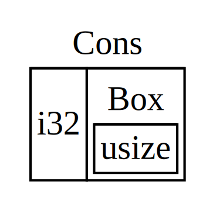

# Smart Pointers

A pointer is a variable that stores a memory address. The most common kind of pointer in Rust is a reference, which are indicated by `&` and borrow the value they point to. No special capabilities other than referring to data, and no overhead.

Smart pointers, are data structures that act like a pointer but also have additional metadata and capabilities.

Typically implemented using structs by implementing the `Deref` and `Drop` traits so they can be used like a reference.
- `Deref` trait allows an instance of the smart pointer struct to behave like a reference so you can write your code to work with either references or smart pointers
- `Drop` trait allows you to customize the code that's run when an instance of the smart pointer goes out of scope

### What's the Difference Between a Reference and a Smart Pointer?

References only borrow data, but in most cases smart pointers *own* the data they point to.

## Using `Box<T>` to Point to Data on the Heap

Boxes allow you to store data on the heap rather than the stack. On the stack, we store the pointer to the heap data. They only povide indirection and heap allocation.

This is how to store an `i32` value on the heap:

```rs
fn main() {
    let b = Box::new(5);
    println!("b={b}");
}
```

Not very practical, it's more appropriate to store primitives on the stack rather than the heap.

### Use Case #1: When a Type Whose Size Can't Be Known at Compile Time

To solve this, we use a value of that type in a context that requires an exact size - `Box<T>`

### Cons List

Data structure made up of listed pairs -- like a Linked List: `(1, (2, (3, Nil)))`

We produce this by recursively calling the `cons` function and we denote the base case of the recursion as `Nil`
- Note that `Nil` != "null" or "nil" discussed in Enums

```rs
enum List {
    Cons(i32, List),
    Nil,
}
```

Here, we use it in the following:

```rs
use crate::List::{Cons, Nil};

fn main() {
    let list = Cons(1, Cons(2, Cons(3, Nil)));
}
```

This doesn't compile - why?
- The `List` type has **infinite size**. We defined `List` with a variant that is recursive, i.e holds another value of itself directly
- The compiler starts at the `Cons` variant, which holds a type of `i32` and a value of type `List`.
- Therefore, to find `sizeof(List)`, we do `len(Cons) = sizeof(i32) + sizeof(List)`, and this process continues infinitely.

The following displays a visual representation:


To fix this, we insert *indirection*, so instead of storing a value directly, we change the data structure to store the value indirectly via storing a pointer to the value instead on the heap. Instead of storing some mystery amount, we store the amount of `Box<T>`, which is a known pointer size. The `Box<T>` will point to the next `List` value that will be on the heap rather than inside the `Cons` variant.

```rs
enum List {
    Cons(i32, Box<List>),
    Nil,
}

use crate::List::{Cons, Nil};

fn main() {
    let list = Cons(1, Box::new(Cons(2, Box::new(Cons(3, Box::new(Nil))))));
}
```

Now, `sizeof(list) = sizeof(i32) + sizeof(Box<T>)`



### Defining Your Own Smart Pointer

Observe the following code:

```rs
struct MyBox<T>(T);

impl<T> MyBox<T> {
    fn new(x: T) -> MyBox<T> {
        MyBox(x)
    }
}

fn main() {
    let x = 5;
    let y = MyBox::new(x);

    assert_eq!(5, x);
    assert_eq!(5, *y);
}
```

This code won't compile. Why?

The `MyBox<T>` type can't be dereferenced because it doesn't implement the `Deref` trait.

When we call `*y`, Rust expands it to `*(y.deref())`. Rust keeps doing this until it has a value of type `T`.

### Using Deref Coercion in Functions and Methods

_Deref Coercion_ is a feature that Rust provides to simplify calling methods on dereferenced values.

Observe the following code:

```rs
fn hello(name: &str) {
    println!("Hello, {name}!");
}

fn main() {
    let m = MyBox::new(String::from("Rust"));
    hello(&m);
}
```

Rust can turn `&MyBox<String>` into `&String` by using deref coercion.

## Running Code on Cleanup with the `Drop` Trait

### Cleaning Up a Value BEFORE the End of Scope using `std::mem::drop`

Observe the following code:

```rs
fn main() {
    let c = CustomSmartPointer {
        data: String::from("some data"),
    };
    println!("CustomSmartPointer created");
    drop(c);
    println!("CustomSmartPointer dropped before the end of main");
}
```

## `RC<T>`: The Reference-Counted Smart Pointer

Keeps track of the number of references to a value on the heap. If # of references == 0, the value is dropped.

We do this via `RC::new` and `RC::clone`. To see the explicit number of references, we use `RC::strong_count`.

```rs
fn main() {
    let a = Rc::new(Cons(5, Rc::new(Cons(10, Rc::new(Nil)))));
    println!("count after creating a = {}", Rc::strong_count(&a));
    let b = Cons(3, Rc::clone(&a));
    println!("count after creating b = {}", Rc::strong_count(&a));
    {
        let c = Cons(4, Rc::clone(&a));
        println!("count after creating c = {}", Rc::strong_count(&a));
    }
    println!("count after c goes out of scope = {}", Rc::strong_count(&a));
}
```

## `RefCell<T>`: The Interior-Mutability Smart Pointer

Instead of dealing with compiler rules, we deal with panics at runtime.

### Tracking Borrows at Runtime using `borrow` and `borrow_mut`

- `borrow` returns the smart pointer type `Ref<T>`
- `borrow_mut` returns the smart pointer type `RefMut<T>`
- Both types implement `Deref`, so can be treated like references

### Allowing Multiple Owners of Mutable Data Using `Rc<RefCell<T>>`

With this, `RefCell<T>` ensures that you don't break borrowing rules (like having two mutable borrows at once) by checking them at runtime. If you violate these rules, your program will panic rather than fail to compile.

To see an example, look at `src/bin/mutable_cons.rs`

## When to use `Box<T>`, `Rc<T>`, and `RefCell<T>`

- `Box<T>`: Single owner; allows immutable or mutable borrows checked at compile time
- `Rc<T>`: Multiple owners; allows ONLY immutable borrows checked at compile time
- `RefCell<T>`: Single owner; allows immutable or mutable borrows checked at runtime. Can mutate the value `T` even if `T` is immutable -- **interior mutability pattern**

## Reference Cycles Can Leak Memory

TODO
